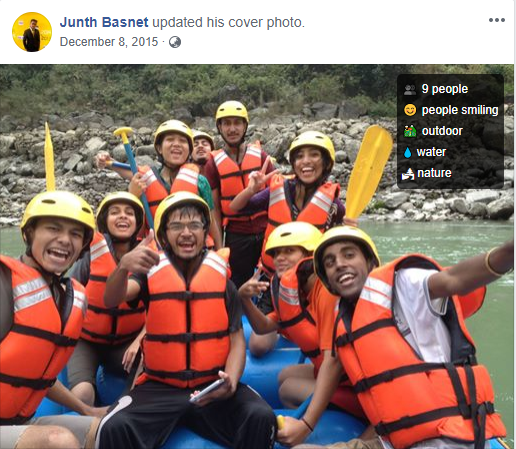
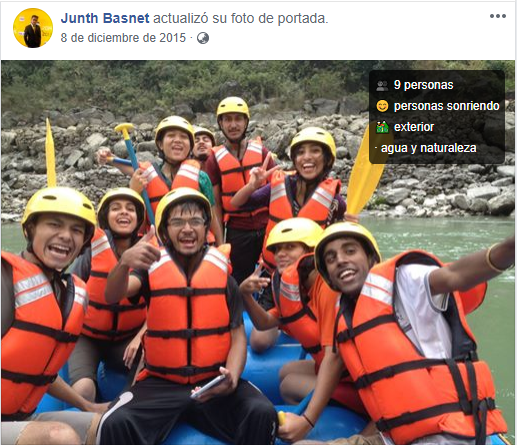
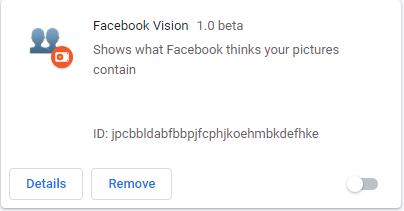
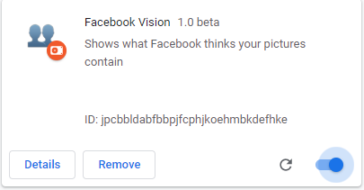

<p align="center">
   <h1 align="center">Facebook Vision Chrome Extension</h1>
</p>
<p align="center">
  
</p>

---

Every time you upload a photo to `Facebook`, its deep-learning algorithms go to work, trying to `ID` things both incredibly specific **(which of your friends is in this photo?)** and general **(Is this photo outdoors or indoors?)**. But that information is largely hidden from users until now. **Facebook Vision** allows anyone to see what general information `Facebook` extracts from every photo that’s been uploaded. Install the extension and head over to `Facebook`, and you can start immediately seeing which objects `Facebook` can ID within pretty much any photo.

[Facebook's FAIR Team](https://ai.facebook.com/) label images using Deep-Learning algorithms( Deep ConvNets).

<p align="center">
  
</p>

This extension is available now for `English: Locale_en_US` and `Spanish: Locale_es_LA` Facebook users.

Emoji is used for most common objects that are extracted by Facebook.
```js
"emoji_map": {
    "1 person": "👤",
    "2 people": "👥",
    "airplane": "✈️",
    "baby": "🍼",
    "beach": "🏖",
    "beard": "👴",
    "bedroom": "🛏",
    "bicycle": "🚲",
    "camera": "📷",
    "car": "🚗",
    "cat": "😺",
    "child": "👦",
    "christmas tree": "🎄",
    "close-up": "👀",
    "closeup": "👀",
    "cloud": "☁️",
    "concert": "🎤",
    "crowd": "👥",
    "dancing": "💃",
    "dessert": "🍰",
    "dog": "🐶",
    "drink": "🍹",
    "eating": "🍽",
    "eyeglasses": "👓",
    "fireworks": "🎆",
    "flower": "🌻",
    "food": "🍎",
    "glasses": "🕶",
    "golf": "🏌️‍",
    "grass": "🍃",
    "hat": "👒",
    "indoor": "🏠",
    "living room": "🏠",
    "meme": "👍",
    "mountain": "🌋",
    "nature": "🏞",
    "night": "🌃",
    "ocean": "🌊",
    "office": "💼",
    "one or more people": "👥",
    "outdoor": "🚵",
    "people dancing": "💃",
    "people eating": "🍽",
    "people on stage": "🎤",
    "people playing musical instruments": "🎸",
    "people playing sport": "🏀",
    "people sitting": "⑁",
    "people smiling": "😊",
    "people standing": "🕴",
    "phone": "📱",
    "plant": "🌿",
    "playing a musical instrument": "🎸",
    "selfie": "🤳",
    "shoes": "👡",
    "sitting": "⑁",
    "sky": "☀️",
    "skyscraper": "🏙",
    "sleeping": "😴",
    "smiling": "😀",
    "snow": "❄️",
    "standing": "🕴",
    "stripes": "💈",
    "suit": "🕴",
    "sunglasses": "🕶",
    "swimming": "🏊",
    "table": "🍽",
    "text": "🔠",
    "tree": "🌴",
    "twilight": "🌃",
    "ultrasound": "🍼",
    "water": "💧",
    "wedding": "💒"
  }
```

The extension itself is super-simple. Once you install it, all the photos you see on your Facebook timeline will automatically be overlaid with their tags.

**English**
<p align="center">
  
</p>

**Spanish**
<p align="center">
  
</p>

## How to install Facebook Vision?
``` js
1. Clone this repository: git clone https://github.com/Junth19/Facebook-Vision.git
2. cd Facebook-Vision.
3. Open Google Chrome and go to chrome://extensions.
4. Enable Developer mode.
5. Click on Load unpacked.
6. Select the path where you cloned this project.
7. Following icon appears besides Chrome Search Bar.
```
<p align="center">
  
</p>

``` js
8. Facebook Vision is added to the Extensions.
```
<p align="center">
  
</p>

``` js
9. Enable Facebook Vision Extension.
```
<p align="center">
  
</p>

## References
1. [See What Facebook Thinks Is in Your Photos](https://nymag.com/intelligencer/2017/01/see-what-facebook-thinks-is-in-your-photos.html)
2. [Creating A Basic Chrome Extension](https://www.thepolyglotdeveloper.com/2018/09/creating-basic-chrome-extension/)

## Future Enhancements
1. Expanding this extension to include any other language. 
